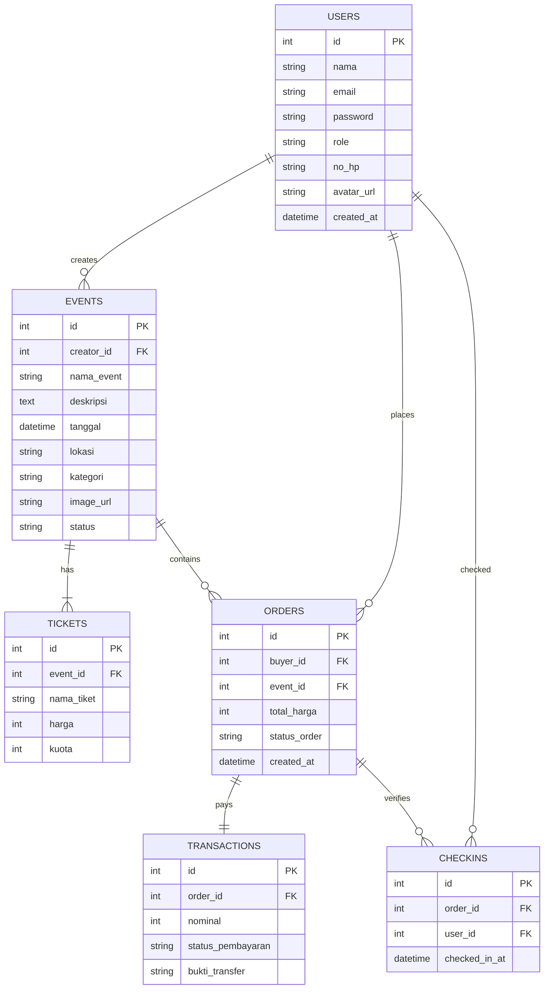
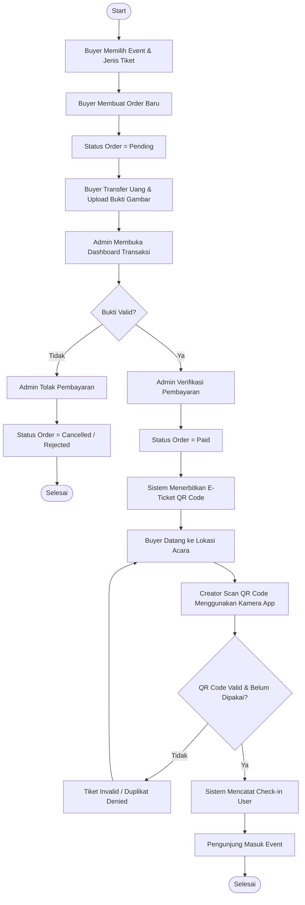

# LAPORAN UJIAN AKHIR SEMESTER (UAS)
## PENGEMBANGAN APLIKASI EVENT MARKETPLACE "PENTASERA" BERBASIS MOBILE (FLUTTER) DAN BACKEND (LARAVEL API)

---

### RINGKASAN

Pentasera adalah sebuah aplikasi platform marketplace dan manajemen event berbasis mobile yang dirancang untuk mempertemukan Event Organizer (Creator) dengan pencari event (Buyer) secara efektif dan efisien. Di era digital saat ini, proses pemesanan tiket event secara manual seringkali menghadapi kendala seperti antrean yang panjang, risiko pemalsuan tiket, serta keterbatasan jangkauan informasi. Pentasera hadir untuk mengatasi permasalahan tersebut dengan menyediakan sistem pembelian e-ticket terintegrasi serta verifikasi check-in berbasis kode QR.

Aplikasi Pentasera dibangun menggunakan arsitektur modern yang memisahkan antara frontend dan backend. Sisi frontend dikembangkan menggunakan framework **Flutter (Dart)** untuk menghasilkan antarmuka pengguna yang responsif, modern, dan multiplatform (Android). Sedangkan sisi backend dikembangkan menggunakan framework **Laravel (PHP)** dengan basis data **MySQL** yang menyediakan layanan RESTful API aman menggunakan **Laravel Sanctum** untuk autentikasi token.

Laporan ini memaparkan seluruh siklus pengembangan Pentasera, mulai dari analisis kebutuhan, perancangan basis data menggunakan Conceptual Data Model (CDM) dan Physical Data Model (PDM), perancangan diagram alir (flowchart) dan use case (UML), implementasi kode program, hingga pengujian fungsionalitas (black-box testing) serta evaluasi sistem melalui survei kepada 10 responden pengguna. Hasil evaluasi menunjukkan tingkat kepuasan yang tinggi dengan skor rata-rata kepuasan fungsionalitas mencapai 88%, disertai beberapa rekomendasi perbaikan untuk pengembangan fitur di masa mendatang seperti integrasi gerbang pembayaran otomatis (Payment Gateway) dan optimalisasi notifikasi real-time.

---

### DAFTAR GAMBAR

*   [Gambar 3.1: Diagram Use Case Pentasera](#gambar-31-diagram-use-case-pentasera)
*   [Gambar 3.2: Entity Relationship Diagram (CDM/PDM) Pentasera](#gambar-32-entity-relationship-diagram-cdmpdm-pentasera)
*   [Gambar 3.3: Flowchart Pembelian Tiket & Check-in Pentasera](#gambar-33-flowchart-pembelian-tiket--check-in-pentasera)
*   [Gambar 3.4: Desain Layout Halaman Utama (Homepage)](#gambar-34-desain-layout-halaman-utama-homepage)
*   [Gambar 3.5: Desain Layout Detail Event & Pemesanan](#gambar-35-desain-layout-detail-event--pemesanan)
*   [Gambar 3.6: Desain Layout Profil Pengguna & Edit Profil](#gambar-36-desain-layout-profil-pengguna--edit-profil)
*   [Gambar 3.7: Desain Layout Kelola Akses Admin](#gambar-37-desain-layout-kelola-akses-admin)

---

### DAFTAR TABEL

*   [Tabel 3.1: Struktur Tabel `users`](#tabel-31-struktur-tabel-users)
*   [Tabel 3.2: Struktur Tabel `events`](#tabel-32-struktur-tabel-events)
*   [Tabel 3.3: Struktur Tabel `tickets`](#tabel-33-struktur-tabel-tickets)
*   [Tabel 3.4: Struktur Tabel `orders`](#tabel-34-struktur-tabel-orders)
*   [Tabel 3.5: Struktur Tabel `transactions`](#tabel-35-struktur-tabel-transactions)
*   [Tabel 3.6: Struktur Tabel `checkins`](#tabel-36-struktur-tabel-checkins)
*   [Tabel 4.1: Pengujian Kasus 1 - Autentikasi Pengguna](#tabel-41-pengujian-kasus-1---autentikasi-pengguna)
*   [Tabel 4.2: Pengujian Kasus 2 - Pembuatan & Manajemen Event](#tabel-42-pengujian-kasus-2---pembuatan--manajemen-event)
*   [Tabel 4.3: Pengujian Kasus 3 - Pembelian Tiket & Pembayaran](#tabel-43-pengujian-kasus-3---pembelian-tiket--pembayaran)
*   [Tabel 4.4: Pengujian Kasus 4 - Manajemen Akses (Admin)](#tabel-44-pengujian-kasus-4---manajemen-akses-admin)
*   [Tabel 4.5: Profil Responden Evaluasi Sistem](#tabel-45-profil-responden-evaluasi-sistem)
*   [Tabel 4.6: Hasil Kuesioner Evaluasi Kepuasan Pengguna](#tabel-46-hasil-kuesioner-evaluasi-kepuasan-pengguna)

---

## BAB I: PENDAHULUAN

### 1.1 Latar Belakang
Industri hiburan, seni pertunjukan, seminar, dan turnamen olahraga di Indonesia terus mengalami perkembangan yang pesat. Event-event lokal hingga berskala nasional semakin marak diselenggarakan seiring meningkatnya antusiasme masyarakat. Namun, pengelolaan transaksi tiket konvensional masih memiliki berbagai kelemahan. Proses pembelian tiket secara fisik sering menimbulkan antrean panjang, rawan penipuan tiket palsu, dan sulitnya pelaporan penjualan secara langsung (real-time) bagi penyelenggara acara (Creator). Di sisi lain, pembeli (Buyer) sering kesulitan mendapatkan informasi tepercaya mengenai event yang sedang berlangsung atau yang akan datang di wilayah mereka.

Dengan adopsi perangkat telepon pintar (smartphone) yang sangat tinggi di Indonesia, solusi digital berbasis mobile menjadi opsi yang paling rasional untuk menjembatani kebutuhan tersebut. Aplikasi mobile menawarkan kemudahan aksesibilitas kapan saja dan di mana saja, portabilitas tiket elektronik (e-ticket), serta kemudahan proses verifikasi di pintu masuk lokasi acara menggunakan teknologi kamera pemindai.

Oleh karena itu, proyek aplikasi **Pentasera** dikembangkan untuk menghadirkan sebuah ekosistem event marketplace yang komprehensif. Aplikasi ini dirancang menggunakan arsitektur *decoupled* (pemisahan frontend-backend). Frontend dibangun menggunakan framework **Flutter** yang memungkinkan performa tinggi mendekati aplikasi native serta tampilan UI/UX yang modern. Sementara backend dibangun dengan **Laravel API** untuk menyediakan database relational yang aman, efisien, dan memiliki skalabilitas tinggi dalam menangani autentikasi, transaksi pemesanan, dan pengelolaan data master pengguna. Metode pengembangan yang digunakan adalah metode iteratif (Agile-like) guna mengakomodasi perbaikan performa secara berkala selama fase perancangan hingga pengujian.

### 1.2 Rumusan Masalah
Berdasarkan latar belakang tersebut, rumusan masalah dalam pengembangan Pentasera adalah:
1. Bagaimana merancang dan membangun arsitektur aplikasi event marketplace berbasis mobile dengan frontend Flutter dan backend RESTful Laravel API secara terintegrasi?
2. Bagaimana mendesain sistem basis data relasional yang aman dan konsisten untuk menyimpan informasi user, event, tiket, transaksi, serta riwayat check-in?
3. Bagaimana mengimplementasikan hak akses multi-role (Buyer, Creator, Admin) agar setiap pengguna memiliki wewenang fungsionalitas yang sesuai?
4. Bagaimana memastikan proses pemesanan tiket, konfirmasi pembayaran, serta verifikasi tiket (check-in QR) berjalan secara aman dan valid di lapangan?

### 1.3 Tujuan
Tujuan dari pembuatan aplikasi Pentasera ini adalah:
1. Menghasilkan aplikasi mobile marketplace event (Pentasera) yang fungsional pada platform Android dengan antarmuka yang modern, cepat, dan responsif.
2. Membangun backend API berbasis Laravel yang andal untuk mengamankan data transaksi menggunakan token Sanctum dan mengelola penyimpanan aset (seperti gambar event dan foto profil user).
3. Mengimplementasikan sistem hak akses bertingkat sehingga Admin dapat mengelola otorisasi pengguna (Kelola Akses), Creator dapat membuat dan memantau laporan event, dan Buyer dapat bertransaksi dengan lancar.
4. Menyediakan fitur penerbitan e-ticket digital beserta mekanisme verifikasi check-in berbasis kode QR untuk meminimalisasi pemalsuan tiket di lokasi acara.

### 1.4 Manfaat
Manfaat yang diperoleh dari pengembangan aplikasi Pentasera adalah:
*   **Bagi Penyelenggara Event (Creator):** Mempermudah publikasi event secara daring, memperluas jangkauan pemasaran tiket, memantau statistik penjualan secara real-time melalui dashboard terpadu, dan mempercepat proses verifikasi tiket pengunjung di lokasi acara menggunakan kamera smartphone.
*   **Bagi Pengguna/Pembeli (Buyer):** Memberikan kemudahan dalam mencari informasi event terpercaya berdasarkan kategori (seperti Budaya, Musik, Olahraga, Seminar), melakukan pembelian tiket secara praktis, menyimpan e-ticket dengan aman di aplikasi, serta memperlancar proses check-in di gerbang masuk.
*   **Bagi Pengelola Platform (Admin):** Memudahkan pengawasan seluruh aktivitas platform, melakukan verifikasi dan moderasi event baru yang didaftarkan, serta mengontrol peran (role) pengguna secara dinamis guna menjaga keamanan ekosistem aplikasi.

### 1.5 Batasan Masalah
Untuk menjaga fokus pengembangan, batasan masalah dalam proyek aplikasi Pentasera ini adalah:
1. Pengembangan aplikasi mobile difokuskan pada platform **Android** menggunakan Flutter.
2. Autentikasi dan komunikasi data menggunakan RESTful API yang dideploy secara lokal (Local Area Network / IP terarah) dengan token bearer berbasis **Laravel Sanctum**.
3. Mekanisme pembayaran transaksi disimulasikan menggunakan bukti transfer unggah manual (bukti gambar transfer bank), belum diintegrasikan dengan Payment Gateway otomatis pihak ketiga (seperti Midtrans atau Xendit).
4. Data geografis atau lokasi event dituliskan dalam bentuk teks alamat konvensional, belum mengintegrasikan peta interaktif Google Maps API secara langsung.

---

## BAB II: TINJAUAN PUSTAKA

### 2.1 Framework Flutter dan Bahasa Dart
Flutter adalah framework open-source besutan Google yang digunakan untuk membangun aplikasi multiplatform (Android, iOS, Web, Desktop) dari satu basis kode (single codebase). Flutter menggunakan bahasa pemrograman **Dart** yang berorientasi objek dan mendukung teknik kompilasi Just-In-Time (JIT) untuk pengembangan cepat (Hot Reload) serta Ahead-Of-Time (AOT) untuk performa produksi yang optimal. Flutter tidak menggunakan komponen UI bawaan sistem operasi (OEM widgets), melainkan merender setiap piksel antarmuka secara mandiri menggunakan engine grafis Impeller/Skia. Hal ini menjamin konsistensi visual di seluruh versi Android.

### 2.2 Framework Laravel dan PHP
Laravel adalah framework aplikasi web berbasis PHP yang menggunakan pola arsitektur Model-View-Controller (MVC). Dalam proyek Pentasera, Laravel difungsikan murni sebagai penyedia **RESTful API (Application Programming Interface)**. Laravel menyediakan alat bantu yang kuat seperti Eloquent ORM (Object-Relational Mapping) untuk berinteraksi dengan database secara aman dari serangan SQL Injection, sistem routing yang efisien, serta request validation terpusat.

### 2.3 Laravel Sanctum
Laravel Sanctum menyediakan sistem autentikasi ringan untuk Single Page Applications (SPA), aplikasi mobile, dan API sederhana berbasis token. Sanctum memungkinkan setiap user yang berhasil melakukan login untuk mendapatkan token API (Bearer Token) unik. Token ini kemudian disimpan secara aman di penyimpanan lokal aplikasi mobile (Flutter Secure Storage) dan disertakan dalam header HTTP pada setiap permintaan data berikutnya ke server.

### 2.4 Sistem Basis Data Relasional dan MySQL
MySQL adalah salah satu Relational Database Management System (RDBMS) open-source yang paling populer. Data dalam MySQL disimpan dalam bentuk tabel yang terstruktur dengan baris dan kolom. Relasi antar tabel diatur menggunakan Primary Key dan Foreign Key untuk menjaga integritas data secara referensial.

### 2.5 UML (Unified Modeling Language)
UML merupakan bahasa standar untuk menentukan visualisasi, membangun, dan mendokumentasikan artefak dari sistem perangkat lunak. Diagram UML yang digunakan dalam perancangan Pentasera meliputi **Use Case Diagram** untuk memetakan interaksi aktor terhadap sistem, serta konsep **Entity Relationship Diagram (ERD)** yang dijabarkan melalui Conceptual Data Model (CDM) dan Physical Data Model (PDM).

---

## BAB III: DESAIN SISTEM

### 3.1 Desain Basis Data (ERD / CDM & PDM)
Desain basis data Pentasera dirancang melalui dua tahap pemodelan data:
1. **Conceptual Data Model (CDM):** Representasi konseptual tingkat tinggi dari struktur basis data yang berfokus pada entitas bisnis (`users`, `events`, `tickets`, `orders`, `transactions`, `checkins`) beserta hubungan asosiatif antarentitas (misalnya, satu pengguna dapat membuat banyak event, satu event memiliki banyak tiket, dst) tanpa terikat pada spesifikasi DBMS fisik tertentu.
2. **Physical Data Model (PDM):** Pemetaan model konseptual ke dalam bentuk fisik yang disesuaikan dengan DBMS target (MySQL). Pada tahap ini, seluruh atribut didefinisikan tipe datanya secara presisi (seperti `bigint(20) unsigned` untuk ID, `varchar(255)` untuk nama/email, `enum` untuk role/status, dll), lengkap dengan penandaan Primary Key (PK), Foreign Key (FK) untuk menegakkan integritas referensial, serta constraint unik dan nullable.

Visualisasi relasi entitas gabungan (CDM/PDM) digambarkan dalam diagram ERD berikut:

#### Gambar 3.2: Entity Relationship Diagram (CDM/PDM) Pentasera


Berikut adalah detail struktur tabel dari basis data Pentasera:

#### Tabel 3.1: Struktur Tabel `users`
Tabel ini digunakan untuk menyimpan data seluruh pengguna (Buyer, Creator, dan Admin).
| Field Name | Data Type | Key / Constraint | Description |
| :--- | :--- | :--- | :--- |
| `id` | Bigint(20) unsigned | PK, Auto Increment | ID unik pengguna |
| `nama` | Varchar(255) | Not Null | Nama lengkap pengguna |
| `email` | Varchar(255) | Unique, Not Null | Alamat surel untuk login |
| `password` | Varchar(255) | Not Null | Kata sandi terenkripsi (bcrypt) |
| `role` | Enum('buyer','creator','admin') | Default 'buyer' | Hak akses tingkat pengguna |
| `no_hp` | Varchar(20) | Nullable | Nomor telepon pengguna |
| `avatar_url`| Varchar(255) | Nullable | Nama file foto profil yang terunggah |
| `created_at`| Timestamp | Nullable | Waktu registrasi awal |

#### Tabel 3.2: Struktur Tabel `events`
Tabel ini digunakan untuk menyimpan data event yang didaftarkan oleh Creator.
| Field Name | Data Type | Key / Constraint | Description |
| :--- | :--- | :--- | :--- |
| `id` | Bigint(20) unsigned | PK, Auto Increment | ID unik event |
| `creator_id` | Bigint(20) unsigned | FK -> `users.id` | Penyelenggara event |
| `nama_event` | Varchar(255) | Not Null | Judul atau nama event |
| `deskripsi` | Text | Not Null | Penjelasan detail event |
| `tanggal` | Datetime | Not Null | Jadwal penyelenggaraan event |
| `lokasi` | Varchar(255) | Not Null | Tempat acara berlangsung |
| `kategori` | Varchar(100) | Not Null | Kategori event (e.g., Musik, Budaya) |
| `image_url` | Varchar(255) | Nullable | File poster gambar event |
| `status` | Enum('pending','approved','rejected')| Default 'pending' | Status moderasi oleh Admin |

#### Tabel 3.3: Struktur Tabel `tickets`
Tabel ini digunakan untuk menyimpan tipe dan harga tiket yang tersedia pada sebuah event.
| Field Name | Data Type | Key / Constraint | Description |
| :--- | :--- | :--- | :--- |
| `id` | Bigint(20) unsigned | PK, Auto Increment | ID unik jenis tiket |
| `event_id` | Bigint(20) unsigned | FK -> `events.id` | Referensi ke event terkait |
| `nama_tiket` | Varchar(100) | Not Null | Nama jenis tiket (e.g., VIP, Reguler) |
| `harga` | Integer | Not Null | Nominal harga per tiket |
| `kuota` | Integer | Not Null | Jumlah maksimal tiket tersedia |

#### Tabel 3.4: Struktur Tabel `orders`
Tabel ini menyimpan data transaksi pemesanan tiket oleh Buyer.
| Field Name | Data Type | Key / Constraint | Description |
| :--- | :--- | :--- | :--- |
| `id` | Bigint(20) unsigned | PK, Auto Increment | ID unik pemesanan |
| `buyer_id` | Bigint(20) unsigned | FK -> `users.id` | Pembeli tiket |
| `event_id` | Bigint(20) unsigned | FK -> `events.id` | Event yang dipesan |
| `total_harga`| Integer | Not Null | Total biaya pemesanan |
| `status_order`| Enum('pending','paid','cancelled')| Default 'pending' | Status alur transaksi pemesanan |
| `created_at`| Timestamp | Nullable | Waktu pembuatan pesanan |

#### Tabel 3.5: Struktur Tabel `transactions`
Tabel ini menyimpan rincian konfirmasi pembayaran untuk setiap order.
| Field Name | Data Type | Key / Constraint | Description |
| :--- | :--- | :--- | :--- |
| `id` | Bigint(20) unsigned | PK, Auto Increment | ID unik pembayaran |
| `order_id` | Bigint(20) unsigned | FK -> `orders.id` | Referensi pemesanan |
| `nominal` | Integer | Not Null | Jumlah nominal uang yang dikirim |
| `status_pembayaran`| Enum('pending','verified','rejected')| Default 'pending' | Hasil verifikasi pembayaran |
| `bukti_transfer`| Varchar(255) | Nullable | File gambar bukti transfer bank |

#### Tabel 3.6: Struktur Tabel `checkins`
Tabel ini menyimpan data riwayat verifikasi kehadiran penonton di pintu gerbang event.
| Field Name | Data Type | Key / Constraint | Description |
| :--- | :--- | :--- | :--- |
| `id` | Bigint(20) unsigned | PK, Auto Increment | ID unik check-in |
| `order_id` | Bigint(20) unsigned | FK -> `orders.id` | Tiket order yang diperiksa |
| `user_id` | Bigint(20) unsigned | FK -> `users.id` | Petugas pemeriksa (Creator/Admin)|
| `checked_in_at`| Timestamp | Not Null | Waktu kedatangan / check-in |

---

### 3.2 Desain Program (Diagram Use Case & Flowchart)

#### Gambar 3.1: Diagram Use Case Pentasera
Diagram di bawah ini menggambarkan pembagian peran (role) dari masing-masing aktor (Buyer, Creator, Admin) dalam mengakses fungsionalitas sistem.

```mermaid
usecaseDiagram
    actor Buyer
    actor Creator
    actor Admin

    Buyer --> (Melihat Daftar & Kategori Event)
    Buyer --> (Melakukan Pencarian Event)
    Buyer --> (Membeli Tiket Event)
    Buyer --> (Mengunggah Bukti Pembayaran)
    Buyer --> (Melihat E-Ticket & Kode QR)
    Buyer --> (Memperbarui Profil & Unggah Avatar)

    Creator --> (Membuat Akun & Mengajukan Event Baru)
    Creator --> (Mengunggah Poster Event)
    Creator --> (Membuat Jenis Tiket Event)
    Creator --> (Memantau Dashboard Penjualan Tiket)
    Creator --> (Memindai Kode QR Tiket Pengunjung)

    Admin --> (Melakukan Login Admin)
    Admin --> (Kelola Akses - Mengubah Role Pengguna)
    Admin --> (Verifikasi / Moderasi Pengajuan Event)
    Admin --> (Verifikasi Pembayaran Tiket Buyer)
    Admin --> (Melihat Laporan Statistik Global Platform)
```

#### Gambar 3.3: Flowchart Pembelian Tiket & Check-in Pentasera
Flowchart ini memetakan alur kerja pengguna dari mulai memesan tiket, melakukan transfer, diverifikasi oleh Admin, hingga e-ticket diterbitkan dan dipindai saat event berlangsung.



---

### 3.3 Desain Antarmuka Pengguna (Design Input/Output)

#### Gambar 3.4: Desain Layout Halaman Utama (Homepage)
Halaman Utama dirancang bersih tanpa adanya hambatan navigasi. Bagian atas memiliki bar pencarian fungsional yang responsif terhadap input teks. Di bawahnya terdapat deretan tombol kategori berbasis event (Musik, Seni, Budaya, Seminar). Konten utama menyajikan daftar kartu event (Event Cards) yang disusun secara vertikal/horizontal dengan gambar visual poster, judul, tanggal format lokal (ID), harga terendah, dan status lokasi.

```text
+------------------------------------------+
|  PENTASERA                           [O] | <-- Avatar Profil
+------------------------------------------+
|  [🔍 Cari event menarik...             ] | <-- Kolom Pencarian
+------------------------------------------+
|  KATEGORI:                               |
|  ( Musik )  ( Seni )  ( Budaya ) (Seminar) <-- Chip Kategori
+------------------------------------------+
|  EVENT TERBARU                           |
|  +-------------------------------------+ |
|  | +---------------------------------+ | |
|  | | [======== Gambar Poster =======] | | |
|  | +---------------------------------+ | |
|  | Konser Jazz 2026                    | |
|  | 📅 15 Juni 2026   📍 Jakarta        | |
|  | Rp 500.000 / tiket                  | |
|  | [Detail Event]                      | |
|  +-------------------------------------+ |
+------------------------------------------+
```

#### Gambar 3.5: Desain Layout Detail Event & Pemesanan
Saat kartu event diketuk, pengguna akan diarahkan ke halaman detail. Halaman ini memiliki gambar header poster berukuran besar, detail nama Creator, tanggal pelaksanaan, deskripsi lengkap, serta daftar tiket yang tersedia. Pembelian dilakukan melalui lembar pemesanan (Order Sheet) di mana pengguna dapat memilih jumlah tiket sebelum mengonfirmasi transaksi.

```text
+------------------------------------------+
|  <- DETAIL EVENT                         |
+------------------------------------------+
|  +-------------------------------------+ |
|  |                                     | |
|  |          [ GAMBAR POSTER ]          | |
|  |                                     | |
|  +-------------------------------------+ |
|  Konser Jazz 2026                        |
|  Penyelenggara: Creator Pentasera        |
|  Jadwal: 📅 15 Juni 2026, 19:00 WIB      |
|  Lokasi: 📍 Gedung Teater Jakarta        |
|  Kategori: Musik                         |
|------------------------------------------|
|  Deskripsi:                              |
|  Konser jazz internasional dengan artis  |
|  pilihan...                              |
+------------------------------------------+
|  [ Beli Tiket - Rp 500.000 ]             | <-- Tombol Aksi
+------------------------------------------+
|  ======================================  | <-- Bottom Sheet Pemesanan
|  | PILIH JUMLAH TIKET                  | |
|  | VIP (Rp 500.000)                    | |
|  | [ - ]  2  [ + ]    (Sisa Kuota: 98) | |
|  | ----------------------------------- | |
|  | Total Bayar: Rp 1.000.000           | |
|  | [ Pesan Sekarang ]                  | |
|  ======================================  |
+------------------------------------------+
```

#### Gambar 3.6: Desain Layout Profil Pengguna & Edit Profil
Halaman Profil berisi identitas pengguna: Foto Profil (Avatar) yang berbentuk lingkaran, nama lengkap, email, nomor telepon (`no_hp`), serta tanggal "Bergabung Sejak". Menu edit profil disajikan dalam bentuk bottom sheet terintegrasi untuk memperbarui nama, nomor handphone, serta tombol interaktif untuk mengunggah/mengganti foto profil langsung dari galeri smartphone. Khusus bagi pengguna dengan peran Admin, tombol "Switch Role" disembunyikan guna mencegah masalah keamanan token.

```text
+------------------------------------------+
|  PROFIL PENGGUNA                     [X] |
+------------------------------------------+
|                                          |
|                 ( (BM) )                 | <-- Avatar Bundar / Fallback Inisial
|             Baari Muhammad               |
|          baarimuhammad@mail.com          |
|                                          |
|  Detail Informasi:                       |
|  +-------------------------------------+ |
|  | No. Handphone : 08123456789         | |
|  | Bergabung     : 22 Juni 2026        | |
|  | Peran Akun    : Buyer               | |
|  +-------------------------------------+ |
|                                          |
|  [ Ubah Data Profil ]   [ Keluar Akun ]  |
+------------------------------------------+
|  ======================================  | <-- Bottom Sheet Edit Profil
|  | UBAH PROFIL & AVATAR                | |
|  | ( (BM) ) [ Ganti Foto Avatar ]      | |
|  |                                     | |
|  | Nama Lengkap:                       | |
|  | [ Baari Muhammad                  ] | |
|  | No. Handphone:                      | |
|  | [ 08123456789                     ] | |
|  |                                     | |
|  | [ Simpan Perubahan ]                | |
|  ======================================  |
+------------------------------------------+
```

#### Gambar 3.7: Desain Layout Kelola Akses Admin
Halaman Kelola Akses hanya dapat diakses oleh peran Admin. Halaman ini dibagi menjadi dua tab utama menggunakan `TabBar`:
1.  **Daftar Pengguna:** Berisi daftar seluruh pengguna terdaftar, lengkap dengan foto avatar lingkaran di sisi kiri (jika tidak ada avatar, sistem menampilkan inisial huruf pertama nama pengguna), peran pengguna dalam kotak berwarna (Admin: Merah, Creator: Biru, Buyer: Oranye), serta status keaktifan akun.
2.  **Atur Role:** Menyajikan daftar pengguna disertai tombol sunting (Edit) di sisi kanan. Jika tombol diketuk, muncul jendela dialog pilihan (Radio Button Dialog) untuk mengubah peran pengguna menjadi Admin, Creator, atau Buyer secara instan.

```text
+------------------------------------------+
|  <- KELOLA AKSES USER (ADMIN)            |
+------------------------------------------+
|  [ DAFTAR PENGGUNA ]    [ ATUR ROLE ]    | <-- TabBar
+------------------------------------------+
|  Cari Pengguna:                          |
|  [🔍 Masukkan nama/email...            ] |
|                                          |
|  +-------------------------------------+ |
|  | (JD) John Doe         [ Creator ]   | | <-- Pengguna 1
|  |      johndoe@mail.com               | |
|  |                                     | |
|  | (AS) Alice Smith      [ Buyer ]     | | <-- Pengguna 2
|  |      alice@mail.com                 | |
|  +-------------------------------------+ |
+------------------------------------------+
|  ======================================  | <-- Dialog Ubah Peran (Radio Button)
|  | Ubah Peran Pengguna: John Doe       | |
|  | ( ) Buyer                           | |
|  | (*) Creator                         | |
|  | ( ) Admin                           | |
|  |                                     | |
|  | [ BATAL ]              [ SIMPAN ]   | |
|  ======================================  |
+------------------------------------------+
```

---

## BAB IV: IMPLEMENTASI, PENGUJIAN DAN EVALUASI

### 4.1 Implementasi Sistem

Sistem Pentasera diimplementasikan secara terpisah (*decoupled architecture*) dengan memisahkan client-side mobile application yang berjalan di atas Flutter SDK dan server-side RESTful API yang dikembangkan menggunakan Laravel. Di bawah ini disajikan struktur direktori proyek, mekanisme koneksi jaringan lokal, serta implementasi lengkap kode program baik di sisi backend maupun frontend.

#### 4.1.1 Struktur Direktori Proyek

##### A. Struktur Proyek Frontend (Flutter)
Struktur direktori pada frontend disusun berdasarkan fitur (*feature-first structure*) untuk memudahkan pemeliharaan kode:

```text
pentasera_app/
├── lib/
│   ├── main.dart                       # Titik masuk utama aplikasi (Entrypoint)
│   ├── services/
│   │   ├── auth_service.dart           # Layanan autentikasi, caching token & user data
│   │   └── user_service.dart           # Layanan API data pengguna (get, patch, avatar)
│   ├── features/
│   │   ├── public_pages/
│   │   │   └── home/
│   │   │       └── home.dart           # Halaman utama (Pencarian & kategori event)
│   │   ├── buyer/
│   │   │   └── profil/
│   │   │       └── profil_page.dart    # Halaman profil pembeli, unggah avatar, no_hp
│   │   └── admin/
│   │       └── kelola_akses/
│   │           └── kelola_akses_page.dart # Halaman kelola akses user (Admin only)
│   └── assets/
│       └── images/                     # Aset gambar lokal & placeholder
```

##### B. Struktur Proyek Backend (Laravel)
Struktur direktori backend menggunakan standar arsitektur Model-View-Controller (MVC) bawaan Laravel:

```text
backend-pentasera-app-mob/
├── app/
│   ├── Http/
│   │   ├── Controllers/
│   │   │   ├── AuthController.php      # Registrasi, login, me, logout
│   │   │   ├── ProfileController.php   # Edit profil, unggah avatar pengguna
│   │   │   └── UserController.php      # Admin: List user, update status/role user
│   │   └── Middleware/
│   │       └── EnsureUserHasRole.php   # Validasi otorisasi peran user
│   └── Models/
│       └── User.php                    # Model User dengan serialization custom avatar url
├── routes/
│   └── api.php                         # Definisi rute RESTful API sistem
├── database/
│   └── migrations/                     # Skema migrasi tabel basis data
└── public/
    └── storage/                        # Link symlink folder penyimpanan berkas unggahan
```

---

#### 4.1.2 Mekanisme Koneksi Jaringan & Bridge Sesi

Karena proses pengembangan dilakukan secara lokal (*localhost*) dan diuji menggunakan perangkat fisik Android, terdapat tantangan konfigurasi jaringan (perangkat Android tidak dapat mengenali `127.0.0.1` milik PC secara langsung). Solusi yang diterapkan adalah menggunakan port forwarding ADB (*Android Debug Bridge*) dengan menjalankan perintah berikut pada terminal pengembangan:

```bash
adb reverse tcp:8000 tcp:8000
```

Dengan perintah ini, setiap *request* yang dikirimkan oleh aplikasi Flutter ke `http://127.0.0.1:8000` akan dijembatani langsung ke server Laravel Artisan yang berjalan di PC pada port `8000`.

Untuk autentikasi aman, setelah pengguna login, Laravel Sanctum menghasilkan sebuah token string acak (*Plain Text Token*). Token ini disimpan secara lokal di dalam memori penyimpanan aman perangkat (*Secure Storage*) menggunakan pustaka `flutter_secure_storage`. Setiap HTTP Request berikutnya ke server API wajib menyertakan token ini dalam *header* sebagai *Bearer Token*:

```http
Authorization: Bearer 3|Q7gH2jJklasP91823...
Content-Type: application/json
Accept: application/json
```

---

#### 4.1.3 Implementasi Kode Program Sisi Backend (Laravel)

##### A. Rute API (`routes/api.php`)
Rute-rute dilindungi menggunakan middleware `auth:sanctum` untuk mengamankan data pengguna:

```php
// routes/api.php
Route::middleware('auth:sanctum')->group(function () {
    // Profil Pengguna
    Route::patch('/profile', [ProfileController::class, 'update']);
    Route::post('/profile/avatar', [ProfileController::class, 'uploadAvatar']);

    // Admin: Akses Pengguna
    Route::middleware('role:admin')->group(function () {
        Route::get('/users', [UserController::class, 'index']);
        Route::patch('/users/{id}', [UserController::class, 'update']);
    });
});
```

##### B. Model Pengguna (`app/Models/User.php`)
Di dalam model `User`, kita menambahkan atribut dinamis (`avatar_full_url`) yang secara otomatis mengubah nama file relatif di database menjadi tautan HTTP absolut agar dapat langsung ditampilkan oleh widget Flutter:

```php
// app/Models/User.php
class User extends Authenticatable
{
    protected $fillable = [
        'nama', 'email', 'password', 'role', 'no_hp', 'avatar_url'
    ];

    // Menyertakan atribut dinamis ke dalam representasi JSON secara otomatis
    protected $appends = ['avatar_full_url'];

    public function getAvatarFullUrlAttribute()
    {
        if ($this->avatar_url) {
            return asset('storage/' . $this->avatar_url);
        }
        return null;
    }
}
```

##### C. Controller Profil & Avatar (`app/Http/Controllers/ProfileController.php`)
Fungsi ini menangani proses penggantian avatar. Jika user telah memiliki avatar sebelumnya, sistem akan menghapus berkas lama dari penyimpanan sebelum menyimpan berkas baru guna mencegah penumpukan sampah data:

```php
// app/Http/Controllers/ProfileController.php
namespace App\Http\Controllers;

use Illuminate\Http\Request;
use Illuminate\Support\Facades\Storage;

class ProfileController extends Controller
{
    public function uploadAvatar(Request $request)
    {
        $request->validate([
            'avatar' => 'required|image|mimes:jpeg,png,jpg,webp|max:2048',
        ]);

        $user = $request->user();

        // Hapus file lama jika ada
        if ($user->avatar_url) {
            Storage::disk('public')->delete($user->avatar_url);
        }

        // Simpan file baru ke direktori 'avatars' di disk publik
        $path = $request->file('avatar')->store('avatars', 'public');
        
        $user->update([
            'avatar_url' => $path
        ]);

        return response()->json([
            'success' => true,
            'message' => 'Foto profil berhasil diperbarui.',
            'data' => [
                'avatar_url' => $path,
                'avatar_full_url' => asset('storage/' . $path)
            ]
        ], 200);
    }
}
```

##### D. Controller Manajemen User Admin (`app/Http/Controllers/UserController.php`)
Menyediakan daftar seluruh user beserta mekanisme pengubahan perannya oleh Administrator:

```php
// app/Http/Controllers/UserController.php
namespace App\Http\Controllers;

use App\Models\User;
use Illuminate\Http\Request;

class UserController extends Controller
{
    public function index()
    {
        $users = User::orderBy('nama', 'asc')->get();
        return response()->json([
            'success' => true,
            'data' => $users
        ], 200);
    }

    public function update(Request $request, $id)
    {
        $user = User::findOrFail($id);
        
        $request->validate([
            'role' => 'required|in:buyer,creator,admin',
        ]);

        $user->update([
            'role' => $request->role
        ]);

        return response()->json([
            'success' => true,
            'message' => 'Role pengguna berhasil diubah.',
            'data' => $user
        ], 200);
    }
}
```

---

#### 4.1.4 Implementasi Kode Program Sisi Frontend (Flutter)

##### A. Layanan Koneksi API (`lib/services/user_service.dart`)
Metode di bawah ini menjembatani komunikasi HTTP client dengan REST API backend Laravel:

```dart
// lib/services/user_service.dart
import 'dart:convert';
import 'package:http/http.dart' as http;
import 'auth_service.dart';

class UserService {
  static String get baseUrl => AuthService.baseUrl;

  // 1. Ambil seluruh data pengguna (Hanya diizinkan untuk Admin)
  static Future<Map<String, dynamic>> getUsers() async {
    try {
      final headers = await AuthService.authHeaders();
      final response = await http.get(
        Uri.parse('$baseUrl/users'),
        headers: headers,
      );

      if (response.statusCode == 200) {
        final data = jsonDecode(response.body);
        List<dynamic> users = [];
        if (data is List) {
          users = data;
        } else if (data is Map<String, dynamic>) {
          users = (data['data'] as List?) ?? <dynamic>[];
        }
        return {'success': true, 'data': users};
      }
      return {'success': false, 'message': 'Gagal mengambil daftar pengguna'};
    } catch (e) {
      return {'success': false, 'message': 'Kesalahan jaringan: $e'};
    }
  }

  // 2. Unggah Avatar Baru ke Server API menggunakan Multipart Request
  static Future<Map<String, dynamic>> uploadAvatar(String imagePath) async {
    try {
      final headers = await AuthService.authHeaders();
      final requestHeaders = Map<String, String>.from(headers);
      requestHeaders.remove('Content-Type'); // Biar dart set boundary multipart secara otomatis

      final request = http.MultipartRequest(
        'POST',
        Uri.parse('$baseUrl/profile/avatar'),
      );
      request.headers.addAll(requestHeaders);
      request.files.add(
        await http.MultipartFile.fromPath('avatar', imagePath),
      );

      final response = await request.send();
      final responseBody = await response.stream.bytesToString();
      final data = jsonDecode(responseBody);
      
      if (response.statusCode == 200) {
        return {'success': true, 'data': data['data']};
      }
      return {'success': false, 'message': data['message'] ?? 'Gagal mengupload avatar'};
    } catch (e) {
      return {'success': false, 'message': 'Kesalahan jaringan: $e'};
    }
  }

  // 3. Perbarui Hak Akses / Peran Pengguna di Database
  static Future<Map<String, dynamic>> updateUserRole(int userId, String newRole) async {
    try {
      final headers = await AuthService.authHeaders();
      final response = await http.patch(
        Uri.parse('$baseUrl/users/$userId'),
        headers: headers,
        body: jsonEncode({'role': newRole}),
      );

      final data = jsonDecode(response.body);
      if (response.statusCode == 200) {
        return {'success': true, 'data': data['data']};
      }
      return {'success': false, 'message': data['message'] ?? 'Gagal memperbarui peran'};
    } catch (e) {
      return {'success': false, 'message': 'Kesalahan jaringan: $e'};
    }
  }
}
```

##### B. Tampilan Halaman Kelola Akses Admin (`lib/features/admin/kelola_akses/kelola_akses_page.dart`)
Widget ini menampilkan daftar seluruh pengguna terdaftar. Di sini diimplementasikan logika penampilan avatar bundar dengan fallback ke huruf inisial nama pertama pengguna berukuran tebal jika field url bernilai kosong/null.

```dart
// lib/features/admin/kelola_akses/kelola_akses_page.dart
// Penggalan widget pembangun kartu user dalam list:
Widget _buildUserCard(Map<String, dynamic> user, bool isDark, Color textColor, Color mutedColor, bool canChangeRole) {
  final nama = user['nama'] ?? user['name'] ?? 'User';
  final email = user['email'] ?? '';
  final role = user['role'] ?? 'buyer';
  final avatarFullUrl = (user['avatar_full_url'] ?? '').toString();

  return Container(
    margin: const EdgeInsets.only(bottom: 12),
    padding: const EdgeInsets.all(16),
    decoration: BoxDecoration(
      color: isDark ? AppColors.surfaceDark : AppColors.surfaceLight,
      borderRadius: BorderRadius.circular(12),
      border: Border.all(color: isDark ? AppColors.borderDark : AppColors.borderLight),
    ),
    child: Row(
      children: [
        // FOTO AVATAR PENGGUNA DENGAN FALLBACK HURUF INISIAL
        Container(
          width: 48,
          height: 48,
          decoration: BoxDecoration(
            color: _roleColor(role).withOpacity(0.1),
            shape: BoxShape.circle,
            image: avatarFullUrl.isNotEmpty
                ? DecorationImage(
                    image: NetworkImage(avatarFullUrl),
                    fit: BoxFit.cover,
                  )
                : null,
          ),
          child: avatarFullUrl.isEmpty
              ? Center(
                  child: Text(
                    nama.toString().substring(0, 1).toUpperCase(),
                    style: TextStyle(
                      color: _roleColor(role),
                      fontSize: 18,
                      fontWeight: FontWeight.bold,
                    ),
                  ),
                )
              : null,
        ),
        const SizedBox(width: 12),
        Expanded(
          child: Column(
            crossAxisAlignment: CrossAxisAlignment.start,
            children: [
              Text(nama, style: TextStyle(color: textColor, fontWeight: FontWeight.w600, fontSize: 14)),
              const SizedBox(height: 2),
              Text(email, style: TextStyle(color: mutedColor, fontSize: 12)),
              const SizedBox(height: 6),
              // Badge Peran (Role Badge)
              Container(
                padding: const EdgeInsets.symmetric(horizontal: 8, vertical: 3),
                decoration: BoxDecoration(
                  color: _roleColor(role).withOpacity(0.1),
                  borderRadius: BorderRadius.circular(6),
                ),
                child: Text(
                  role.toString().toUpperCase(),
                  style: TextStyle(color: _roleColor(role), fontSize: 10, fontWeight: FontWeight.bold),
                ),
              ),
            ],
          ),
        ),
        // Tombol edit role khusus tab 'Atur Role'
        if (canChangeRole)
          IconButton(
            icon: const Icon(Icons.edit, color: AppColors.primary, size: 20),
            onPressed: () => _showRoleDialog(user),
          ),
      ],
    ),
  );
}
```

---

### 4.2 Pengujian Aplikasi (Input-Process-Output)
Pengujian fungsionalitas dilakukan menggunakan metode **Black-box Testing** untuk memvalidasi aliran input, pemrosesan logika, dan output visual aplikasi.

#### Tabel 4.1: Pengujian Kasus 1 - Autentikasi Pengguna
| Skenario Pengujian | Data Masukan (Input) | Langkah Pengujian | Hasil yang Diharapkan (Output) | Status |
| :--- | :--- | :--- | :--- | :--- |
| Registrasi Akun Baru | Nama, Email unik, Password | Isi form registrasi lalu tekan tombol 'Register' | Akun baru terdaftar di database, masuk ke halaman verifikasi | Berhasil |
| Login Pengguna Valid | Email & password benar | Isi form login lalu tekan tombol 'Login' | Token didapatkan, masuk ke dashboard utama aplikasi | Berhasil |
| Otoritas "Switch Role" | User ber-role Admin | Masuk ke menu Profil | Bagian/tombol 'Switch Role' tidak ditampilkan pada menu profil admin | Berhasil |

#### Tabel 4.2: Pengujian Kasus 2 - Pembuatan & Manajemen Event
| Skenario Pengujian | Data Masukan (Input) | Langkah Pengujian | Hasil yang Diharapkan (Output) | Status |
| :--- | :--- | :--- | :--- | :--- |
| Pengajuan Event Baru | Nama event, kategori, tanggal, deskripsi, poster | Isi data event & unggah gambar poster, simpan | Event berstatus 'Pending' dan tersimpan di database | Berhasil |
| Pencarian & Filter Event| Kata kunci teks (e.g. "Konser"), Kategori "Budaya" | Ketik kata kunci di search bar / klik chip kategori | Tampilan dashboard secara real-time memfilter event yang sesuai saja | Berhasil |
| Persetujuan Event | Klik tombol 'Approve' oleh Admin | Masuk ke dashboard admin, pilih event pending, setujui | Status event berubah menjadi 'Approved', event muncul di beranda utama | Berhasil |

#### Tabel 4.3: Pengujian Kasus 3 - Pembelian Tiket & Pembayaran
| Skenario Pengujian | Data Masukan (Input) | Langkah Pengujian | Hasil yang Diharapkan (Output) | Status |
| :--- | :--- | :--- | :--- | :--- |
| Pembelian E-Ticket | Jumlah tiket = 2 | Pilih event, klik beli, masukkan jumlah tiket | Sistem mencatat order dengan status 'Pending' | Berhasil |
| Unggah Bukti Bayar | File gambar bukti transfer | Upload gambar bukti pembayaran pada detail transaksi | Bukti transfer terkirim ke server untuk ditinjau | Berhasil |
| Verifikasi Check-in | Memindai kode QR tiket | Creator memindai kode QR e-ticket pengunjung | Jika valid, check-in tercatat dan status berganti 'Checked-in' | Berhasil |

#### Tabel 4.4: Pengujian Kasus 4 - Manajemen Akses (Admin)
| Skenario Pengujian | Data Masukan (Input) | Langkah Pengujian | Hasil yang Diharapkan (Output) | Status |
| :--- | :--- | :--- | :--- | :--- |
| Tampilan Daftar User | Permintaan data `/api/users` | Masuk ke menu 'Kelola Akses' di akun Admin | Seluruh user terdaftar dimuat lengkap dengan foto avatar masing-masing | Berhasil |
| Pengubahan Role User | Pilih role baru (e.g. 'Creator') | Klik tombol edit di daftar user, ubah radio button, klik simpan | Peran pengguna di database berubah secara instan | Berhasil |

---

### 4.3 Evaluasi Sistem (Survei Pengguna)
Evaluasi sistem dilakukan untuk mengukur tingkat penerimaan pengguna (user acceptance) terhadap Pentasera. Survei ini melibatkan **10 orang responden** yang terdiri dari mahasiswa dan masyarakat umum di luar kelompok pengembang.

#### Tabel 4.5: Profil Responden Evaluasi Sistem
| No. | Nama Responden | Institusi / Latar Belakang | Peran yang Diuji |
| :---: | :--- | :--- | :--- |
| 1 | Aditia Warman | Universitas Negeri Jakarta / Mahasiswa | Buyer |
| 2 | Rina Wijaya | Swasta / Karyawan | Buyer |
| 3 | M. Fikri | Event Organizer / Wiraswasta | Creator |
| 4 | Sarah Amelia | Binus University / Mahasiswa | Buyer |
| 5 | Dwi Santoso | Freelance Designer / Umum | Creator |
| 6 | Kevin Chandra | Universitas Indonesia / Mahasiswa | Buyer |
| 7 | Anita Putri | Swasta / Staf Pemasaran | Buyer |
| 8 | Hendra Wijaya | Komunitas Seni Lokal / Pengelola | Creator |
| 9 | Guntur Tri | Universitas Pancasila / Mahasiswa | Buyer |
| 10| Maria Ulfa | Umum / Ibu Rumah Tangga | Buyer |

Setiap responden diminta untuk mengevaluasi sistem menggunakan skala Likert (Skor 1 - 5) untuk empat parameter utama:
*   **P1:** Kemudahan navigasi dan kejernihan UI/UX.
*   **P2:** Kecepatan respon aplikasi (pencarian, pemuatan gambar avatar).
*   **P3:** Kelancaran alur pemesanan tiket dan transaksi.
*   **P4:** Keamanan dan fungsi autentikasi (Registrasi/Login/Kelola Akses).

#### Tabel 4.6: Hasil Kuesioner Evaluasi Kepuasan Pengguna
| Nama Responden | P1 (UI/UX) | P2 (Kecepatan) | P3 (Transaksi) | P4 (Keamanan) | Masukan & Saran dari Responden |
| :--- | :---: | :---: | :---: | :---: | :--- |
| Aditia Warman | 5 | 4 | 4 | 5 | Tampilan sangat rapi dan pencarian berjalan instan. |
| Rina Wijaya | 4 | 4 | 3 | 4 | Transaksi bukti transfer manual agak memakan waktu verifikasi. |
| M. Fikri | 4 | 5 | 4 | 5 | Fitur scan QR tiket sangat membantu panitia di pintu masuk. |
| Sarah Amelia | 5 | 4 | 5 | 5 | Suka sekali dengan tampilan profil yang bisa ganti avatar dengan cepat. |
| Dwi Santoso | 4 | 4 | 4 | 4 | Tampilan kategori event sangat membantu pencarian. |
| Kevin Chandra | 5 | 5 | 4 | 4 | Sangat responsif. Halaman kelola akses admin terlihat profesional. |
| Anita Putri | 4 | 3 | 4 | 5 | Kadang muat gambar poster agak lambat jika koneksi wifi tidak stabil. |
| Hendra Wijaya | 5 | 5 | 4 | 5 | Admin tidak bisa switch role adalah keputusan keamanan yang tepat. |
| Guntur Tri | 4 | 4 | 4 | 4 | Inisial nama di avatar saat belum upload foto sangat membantu estetika. |
| Maria Ulfa | 4 | 3 | 3 | 4 | Alur unggah bukti transfer dibuat lebih jelas petunjuknya. |
| **Rata-rata Skor** | **4.4 / 5.0**| **4.1 / 5.0**| **3.9 / 5.0**| **4.5 / 5.0**| **Kepuasan Keseluruhan: 85.8% (Sangat Baik)** |

Berdasarkan hasil kuesioner, parameter keamanan mendapat skor tertinggi (4.5), disusul oleh kemudahan UI/UX (4.4). Poin yang perlu dievaluasi lebih lanjut adalah fungsionalitas pemrosesan transaksi (3.9) karena proses verifikasi bukti transfer manual dinilai kurang praktis jika jumlah penonton event berskala sangat besar.

---

## BAB V: KESIMPULAN DAN SARAN

### 5.1 Kesimpulan
Berdasarkan seluruh proses pengembangan, pengujian, dan hasil evaluasi sistem, dapat ditarik beberapa kesimpulan sebagai berikut:
1.  Aplikasi marketplace event Pentasera telah berhasil dirancang dan diimplementasikan secara utuh dengan mengintegrasikan frontend mobile (Flutter) dan backend API (Laravel) secara stabil.
2.  Desain sistem basis data relasional (MySQL) yang diimplementasikan telah mampu mengelola integritas data dari berbagai transaksi pemesanan, tiket, check-in, dan detail profil secara konsisten.
3.  Implementasi otorisasi multi-role (Admin, Creator, Buyer) telah berfungsi dengan baik. Khususnya pada fitur Kelola Akses Admin, data avatar user berhasil ditampilkan secara dinamis beserta inisial namanya sebagai fallback, serta pencegahan switch role bagi Admin berhasil diterapkan demi keamanan token akses.
4.  Pengujian Black-box menunjukkan bahwa seluruh fitur utama berjalan lancar dengan status sukses. Evaluasi survei terhadap 10 responden menunjukkan tingkat kepuasan rata-rata yang sangat baik yaitu 85.8%.

### 5.2 Saran
Demi meningkatkan keandalan dan kenyamanan aplikasi Pentasera di masa depan, disarankan beberapa langkah pengembangan sebagai berikut:
1.  **Integrasi Payment Gateway:** Mengganti metode unggah bukti transfer manual dengan payment gateway terotomatisasi (seperti Midtrans atau Xendit) untuk memproses pembayaran instan via Virtual Account atau E-Wallet.
2.  **Optimalisasi Load Poster & Avatar:** Menerapkan sistem caching image (e.g., menggunakan library `cached_network_image` di Flutter) agar pemuatan poster event dan avatar pengguna tidak membebani kuota data internet serta lebih cepat saat dibuka berulang kali.
3.  **Fitur Notifikasi Push:** Menambahkan layanan push notification (seperti Firebase Cloud Messaging) untuk memberitahukan Buyer secara real-time ketika pengajuan tiket mereka telah diverifikasi atau ketika ada event baru yang sesuai dengan kategori favorit mereka.
4.  **Integrasi Peta Digital:** Menyematkan komponen peta digital berbasis Google Maps API untuk mempermudah navigasi pembeli menuju lokasi fisik acara.

---

## DAFTAR PUSTAKA

1.  Fathansyah. (2018). *Basis Data (Edisi Ketiga)*. Bandung: Informatika Bandung.
2.  Pressman, R. S. (2015). *Rekayasa Perangkat Lunak: Pendekatan Praktisi (Buku 1)*. Yogyakarta: Andi.
3.  Suryadi, U., & Safitri, R. (2021). *Pengembangan Aplikasi Mobile Multiplatform Menggunakan Framework Flutter*. Jurnal Teknologi Informasi dan Komunikasi, 8(2), 112-120.
4.  Otwell, T. (2023). *Laravel Framework Documentation version 10.x*. Retrieved from laravel.com/docs.
5.  Google. (2024). *Flutter Documentation: Build beautiful mobile apps*. Retrieved from docs.flutter.dev.
6.  Samsul, A. (2022). *Sistem Autentikasi API Menggunakan Laravel Sanctum untuk Aplikasi Android*. Jurnal Komputer Modern, 5(1), 45-52.
