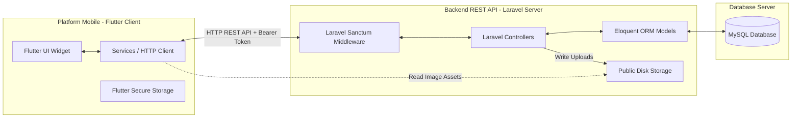
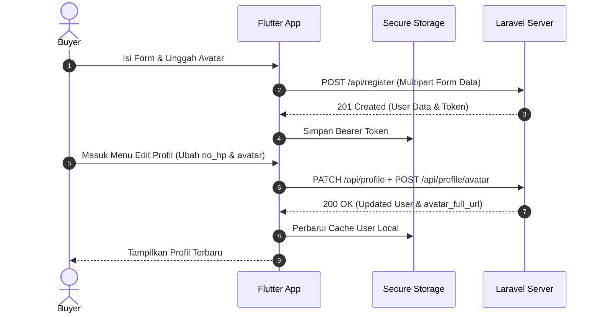
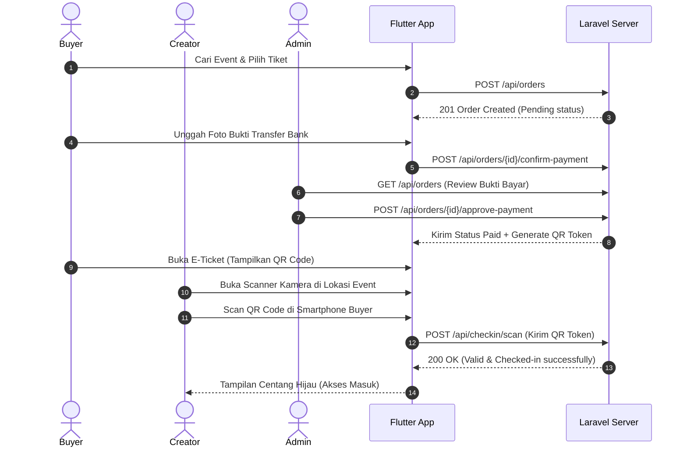

# PRODUCT REQUIREMENT DOCUMENT (PRD)
## PLATFORM EVENT MARKETPLACE & MANAJEMEN TIKET "PENTASERA"

---

## 1. DOKUMEN KONTROL
*   **Nama Produk:** Pentasera
*   **Versi Produk:** 1.0.0
*   **Tanggal Rilis:** Juni 2026
*   **Status Dokumen:** Final (UAS Report Deliverable)
*   **Penulis:** Tim Pengembang Pentasera

---

## 2. RINGKASAN PRODUK
Pentasera adalah solusi digital terpadu untuk memfasilitasi transaksi dan manajemen event di platform mobile. Aplikasi ini dirancang agar penyelenggara event (Creator) dapat dengan mudah membuat event, menerbitkan tiket, memantau penjualan secara real-time, dan melakukan verifikasi check-in pengunjung. Di sisi lain, pengguna (Buyer) mendapatkan pengalaman memesan tiket secara instan, mengunggah bukti pembayaran, mendapatkan e-ticket berformat kode QR, serta mengelola biodata profil secara mandiri. Administrator (Admin) bertugas mengontrol keamanan sistem, memoderasi ajuan event baru, dan mengelola hak akses (role) pengguna secara dinamis.

---

## DAFTAR GAMBAR
*   [Gambar 5.1: Arsitektur Sistem Pentasera](#gambar-51-arsitektur-sistem-pentasera)
*   [Gambar 8.1: Diagram Alur Registrasi, Edit Profil & Unggah Avatar](#gambar-81-diagram-alur-registrasi-edit-profil--unggah-avatar)
*   [Gambar 8.2: Diagram Alur Pemrosesan Tiket & Check-in QR](#gambar-82-diagram-alur-pemrosesan-tiket--check-in-qr)

---

## DAFTAR TABEL
*   [Tabel 4.1: Daftar Kebutuhan Fungsional](#tabel-41-daftar-kebutuhan-fungsional)

---

## 3. IDENTITAS USER PERSONA & MATRIKS HAK AKSES
Pentasera membagi pengguna ke dalam tiga peran (role) dengan otorisasi fungsionalitas sebagai berikut:

### 3.1 Buyer (Pembeli Tiket)
*   **Tujuan:** Menemukan event menarik, membeli tiket secara cepat, melakukan pembayaran, serta menghadiri event menggunakan e-ticket digital tanpa antrean fisik yang lama.
*   **Fungsi Utama:**
    *   Registrasi dan login akun.
    *   Melihat daftar event di beranda dengan fitur pencarian dan filter kategori.
    *   Melakukan pemesanan tiket dan mengunggah gambar bukti transfer.
    *   Mengunduh e-ticket dengan kode QR unik.
    *   Mengubah data profil diri (nama lengkap, nomor handphone) dan mengunggah foto profil (avatar).

### 3.2 Creator (Penyelenggara Event)
*   **Tujuan:** Mempromosikan event secara digital, melacak penjualan tiket, dan memverifikasi kehadiran penonton di pintu gerbang secara efisien.
*   **Fungsi Utama:**
    *   Semua fungsi Buyer (kecuali switch role).
    *   Mengajukan event baru beserta rincian informasi dan poster event.
    *   Membuat beberapa jenis tiket (misal: VIP, Reguler) dengan harga dan kuota tertentu.
    *   Memantau statistik ringkas (penjualan, total pendapatan) melalui dashboard.
    *   Melakukan pemindaian (scanning) kode QR tiket pengunjung di lokasi acara.

### 3.3 Admin (Administrator Platform)
*   **Tujuan:** Mengawasi ekosistem platform, memoderasi pengajuan event, memvalidasi bukti transaksi pembayaran, serta mengelola otorisasi sistem.
*   **Fungsi Utama:**
    *   Melihat ringkasan statistik platform global.
    *   Meninjau, menyetujui (approve), atau menolak (reject) event baru dari Creator.
    *   Memvalidasi bukti transfer transaksi dari Buyer dan mengubah status pemesanan menjadi 'Paid'.
    *   Mengakses modul **Kelola Akses** untuk melihat daftar seluruh pengguna terdaftar beserta foto avatar mereka dan mengubah peran (role) pengguna secara dinamis.
    *   Admin tidak diperkenankan melakukan "Switch Role" di halaman profil guna mengamankan integritas token sesi admin.

---

## 4. DAFTAR KEBUTUHAN FUNGSIONAL (FUNCTIONAL REQUIREMENTS)

#### Tabel 4.1: Daftar Kebutuhan Fungsional
| ID Kebutuhan | Nama Fitur | Deskripsi Fungsional | Aktor Terkait |
| :--- | :--- | :--- | :--- |
| **FR-01** | Autentikasi User | User dapat melakukan pendaftaran akun baru, login menggunakan email & kata sandi, verifikasi email, serta keluar log (logout). | Semua User |
| **FR-02** | Manajemen Profil | User dapat mengubah nama, mengunggah/mengganti foto avatar profil dari galeri, dan memperbarui nomor handphone (`no_hp`). | Semua User |
| **FR-03** | Manajemen Event | Creator dapat menambahkan event, mengedit, mengunggah poster event, serta menentukan kategori event. | Creator, Admin |
| **FR-04** | Manajemen Tiket | Creator dapat menambahkan beberapa variasi tiket beserta harga dan batas kuota untuk setiap event yang dibuat. | Creator |
| **FR-05** | Eksplorasi Event | Buyer dapat menyaring event berdasarkan kategori (Musik, Budaya, dll.), melakukan pencarian berbasis kata kunci secara real-time. | Buyer |
| **FR-06** | Pemesanan Tiket | Buyer dapat memesan sejumlah tiket pada event terpilih dan mengunggah gambar bukti transfer pembayaran. | Buyer |
| **FR-07** | Moderasi Event | Admin dapat meninjau ajuan event berstatus 'Pending' sebelum dipublikasikan ke halaman utama aplikasi. | Admin |
| **FR-08** | Verifikasi Pembayaran| Admin meninjau bukti transfer yang diunggah Buyer dan melakukan verifikasi status transaksi menjadi 'Paid'. | Admin |
| **FR-09** | Penerbitan E-Ticket | Sistem menerbitkan e-ticket digital berisi kode QR unik untuk pesanan yang telah dikonfirmasi 'Paid'. | Buyer, Sistem |
| **FR-10** | Pemindaian Kehadiran| Creator memindai kode QR tiket pengunjung menggunakan kamera perangkat untuk mencatat check-in. | Creator, Admin |
| **FR-11** | Kelola Akses | Admin dapat melihat daftar seluruh user terdaftar beserta avatarnya dan menyunting tingkat role pengguna. | Admin |

---

## 5. SPESIFIKASI TEKNIS & ARSITEKTUR
Aplikasi Pentasera menggunakan pendekatan arsitektur terpisah (decoupled client-server architecture).

#### Gambar 5.1: Arsitektur Sistem Pentasera

### 5.1 Spesifikasi Teknologi (Tech Stack)
*   **Flutter SDK:** Versi 3.x (Dart 3.x)
*   **Penyimpanan Lokal:** `flutter_secure_storage` untuk menyimpan access token JWT/Sanctum dan session data pengguna secara aman.
*   **Laravel Framework:** Versi 10.x (PHP 8.2)
*   **Autentikasi API:** Laravel Sanctum (Token-Based Bearer Authentication).
*   **RDBMS:** MySQL Server untuk penyimpanan data terstruktur relasional.
*   **Penyimpanan Gambar:** Local Storage Laravel (`storage/app/public/`) yang disimbolkan ke link public (`public/storage`) untuk akses file poster event dan avatar profil.

---

## 6. SPESIFIKASI REST API ENDPOINTS

### 6.1 Autentikasi & Profil (`/api`)
*   **POST `/api/register`**
    *   *Input:* `nama`, `email`, `password`, `password_confirmation`
    *   *Output:* Data user baru & token akses Sanctum.
*   **POST `/api/login`**
    *   *Input:* `email`, `password`
    *   *Output:* Data profil user & token akses Sanctum.
*   **GET `/api/me`**
    *   *Header:* `Authorization: Bearer <token>`
    *   *Output:* Data profil user aktif saat ini (termasuk status role, `no_hp`, `avatar_full_url`, dan `created_at`).
*   **PATCH `/api/profile`**
    *   *Header:* `Authorization: Bearer <token>`
    *   *Input:* `nama`, `no_hp` (opsional)
    *   *Output:* Data user terperbarui.
*   **POST `/api/profile/avatar`**
    *   *Header:* `Authorization: Bearer <token>`
    *   *Input Multipart:* `avatar` (File gambar, max 2MB)
    *   *Output:* Status sukses & tautan penuh gambar avatar (`avatar_full_url`).

### 6.2 Manajemen Event & Tiket (`/api`)
*   **GET `/api/events`**
    *   *Output:* Daftar seluruh event yang berstatus disetujui (Approved).
*   **POST `/api/events`**
    *   *Header:* `Authorization: Bearer <token>` (Role: Creator/Admin)
    *   *Input:* `nama_event`, `deskripsi`, `tanggal`, `lokasi`, `kategori`
    *   *Output:* Objek event terdaftar (status default: 'pending').
*   **POST `/api/events/{id}/image`**
    *   *Header:* `Authorization: Bearer <token>` (Role: Creator/Admin)
    *   *Input Multipart:* `image` (File gambar poster)
    *   *Output:* Status sukses & tautan URL gambar poster.

### 6.3 Pemesanan & Pembayaran (`/api`)
*   **POST `/api/orders`**
    *   *Header:* `Authorization: Bearer <token>`
    *   *Input:* `event_id`, `ticket_id`, `quantity`
    *   *Output:* Objek transaksi pemesanan (`order_id`, `total_harga`).
*   **POST `/api/orders/{id}/confirm-payment`**
    *   *Header:* `Authorization: Bearer <token>`
    *   *Input Multipart:* `bukti_transfer` (File bukti transfer bank), `nominal`
    *   *Output:* Status transaksi berganti menjadi menunggu tinjauan admin.

### 6.4 Modul Administrator (`/api`)
*   **GET `/api/users`**
    *   *Header:* `Authorization: Bearer <token>` (Role: Admin)
    *   *Output:* Daftar lengkap seluruh pengguna terdaftar (beserta data `avatar_full_url`).
*   **PATCH `/api/users/{id}`**
    *   *Header:* `Authorization: Bearer <token>` (Role: Admin)
    *   *Input:* `role` (Pilihan: `'buyer'`, `'creator'`, `'admin'`)
    *   *Output:* Objek user dengan role baru.

---

## 7. PERSYARATAN NON-FUNGSIONAL (NON-FUNCTIONAL REQUIREMENTS)
1.  **Keamanan Data (Security):** Kata sandi wajib disimpan menggunakan hashing `bcrypt` di sisi database. Token akses Sanctum harus disimpan dalam media penyimpanan terenkripsi hardware-level (menggunakan *Flutter Secure Storage*), bukan penyimpanan biasa (*SharedPreferences*).
2.  **Kompatibilitas Sistem (Compatibility):** Aplikasi mobile harus dapat beroperasi di perangkat Android minimal versi SDK 21 (Android 5.0 Lollipop) hingga versi terbaru.
3.  **Waktu Respon (Performance):** Pengambilan data event, penyaringan pencarian, dan perubahan tab view harus dimuat di bawah waktu respon 1.5 detik pada jaringan internet standar 3G/4G.
4.  **Skalabilitas & Penanganan Gambar:** Gambar avatar yang diunggah harus otomatis melewati validasi kompresi ukuran file (maksimal 2MB) dan divalidasi format ekstensinya (`.jpg`, `.jpeg`, `.png`) untuk mencegah eksploitasi server.
5.  **Fallback Mekanisme Visual:** Tampilan gambar avatar/poster event harus menggunakan status fallback yang informatif saat memuat atau saat memuat aset mengalami kegagalan (misalnya koneksi server gagal).

---

## 8. ALIRAN PENGGUNA (USER JOURNEY FLOWS)

### 8.1 Alur Registrasi, Edit Profil & Unggah Avatar

#### Gambar 8.1: Diagram Alur Registrasi, Edit Profil & Unggah Avatar

### 8.2 Alur Pemrosesan Tiket & Check-in QR

#### Gambar 8.2: Diagram Alur Pemrosesan Tiket & Check-in QR

